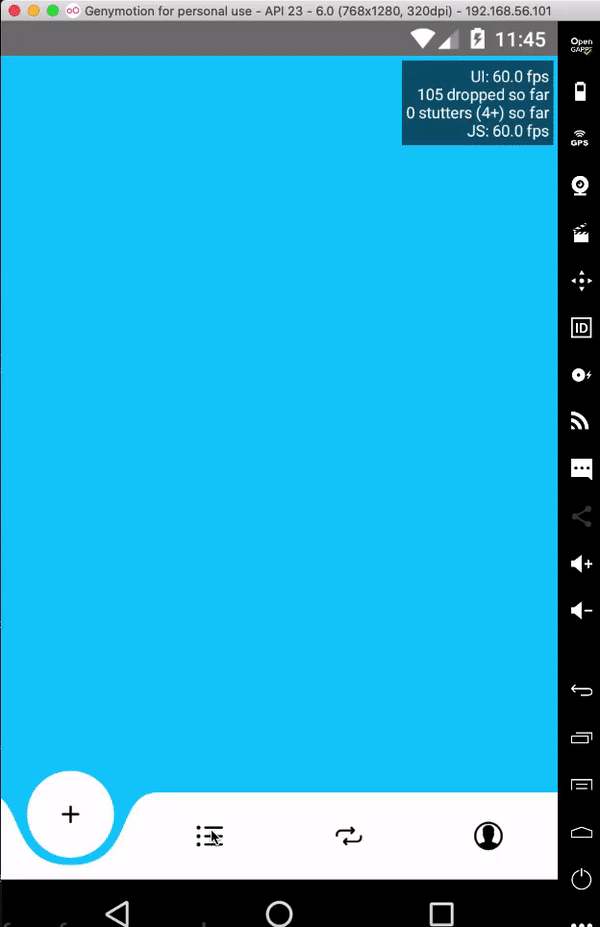

<div align="center">
<h1>Curved Navigation Bar</h1>



High performance animated bottom navigation bar for both Android and IOS 😎 with react navigation v5 or higher.

</div>

---

## Table of Contents

- [Table of Contents](#table-of-contents)
- [Installation](#installation)
- [Usage](#usage)
  - [Animated Icon](#animated-icon)
  - [Animated Title](#animated-title)
- [Props](#props)
  - [TabConfigsType](#tabconfigstype)
- [Built With](#built-with)
- [License](#license)

## Installation

```sh
yarn add curved-bottom-navigation-bar
# or
npm install curved-bottom-navigation-bar
```

> Also, you need to install [react-native-reanimated-v2](https://docs.swmansion.com/react-native-reanimated/docs/installation) & [react-native-svg](https://github.com/react-native-community/react-native-svg), and follow theirs installation instructions.

## Usage

```tsx
import React from 'react';
import { NavigationContainer } from '@react-navigation/native';
import { createBottomTabNavigator } from '@react-navigation/bottom-tabs';
import AnimatedTabBar, {TabsConfigsType} from 'curved-bottom-navigation-bar';
import {SafeAreaProvider} from 'react-native-safe-area-context';
const tabs: TabsConfigsType = {
    Home: {
        icon: ({ progress }) => /* Icon Component */,
        renderTitle: ({ progress, title }) => /* Custom reanimated Component */
    },
    Profile: {
        icon: ({ progress }) => /* Icon Component */,
        renderTitle: ({ progress, title }) => /* Custom reanimated Component */
    },
}

const Tab = createBottomTabNavigator();

export default function App() {
  return (
  <SafeAreaProvider>
    <NavigationContainer>
      <Tab.Navigator
        tabBar={props => (
          <AnimatedTabBar tabs={tabs} {...props} />
        )}
      >
        <Tab.Screen
          name="Home"
          component={HomeScreen}
        />
        <Tab.Screen
          name="Profile"
          component={ProfileScreen}
        />
      </Tab.Navigator>
    </NavigationContainer>
  </SafeAreaProvider>
  )
}
```

### Animated Icon

In order to animate the tab icon color, you will need to use the provded prop `color` that will be provided to the icon.

This example below should explain it better:

```tsx
import React from 'react';
import Animated from 'react-native-reanimated';


interface AnimatedIconProps {
  progress: Animated.SharedValue<number>; // Reanimated - 0 is not Active, 1 is Active
}

const AnimatedIcon = ({ progress }: AnimatedIconProps) => {
  return (
   /* DO SOME THING */
  );
};

export default AnimatedIcon;
```

### Animated Title

Custom title value for tabbar

This example below should explain it better:

```tsx
import React from 'react';
import Animated from 'react-native-reanimated';


interface AnimatedTitleProps {
  progress: Animated.SharedValue<number>; // Reanimated - 0 is not Active, 1 is Active
  title:string;
}

const AnimatedTitle = ({ progress, title }: AnimatedTitleProps) => {
  return (
   /* DO SOME THING */
  );
};

export default AnimatedTitle;
```

## Props

| name           | required | default                          | description                                                                 |
| -------------- | -------- | -------------------------------- | --------------------------------------------------------------------------- |
| duration       | NO       | 500                              | Duration for the tabs animation.                                            |
| barColor         | NO       | #FFFFFF           | background color of bottom bar.              |
| tabs           | YES      |                                  | A dictionary for all tabs configurations, check `TabConfigsType` interface. |
| dotSize          | NO       | 60     | Size of dot.                        |
| dotColor | NO       | #FFFFFF | Color of dot.                                        |
| titleShown | NO       | false | Whether to show or hide the title for the bottom bar                                       |

### TabConfigsType

| name            | required | default | description                                                                        |
| --------------- | -------- | ------- | ---------------------------------------------------------------------------------- |
| icon            | YES      |         |  Component to be render as tab icon, it will recevie an animated node prop `progress`.
| renderTitle            | NO      |         |  Component to be render as tab title, it will recevie an animated node prop `progress` and `title`.

## Built With

- [react-native-reanimated](https://docs.swmansion.com/react-native-reanimated/)
- [react-native-svg](https://github.com/react-native-community/react-native-svg)
- [react-navigation](https://github.com/react-navigation/react-navigation)

## License

MIT

---
</p>
